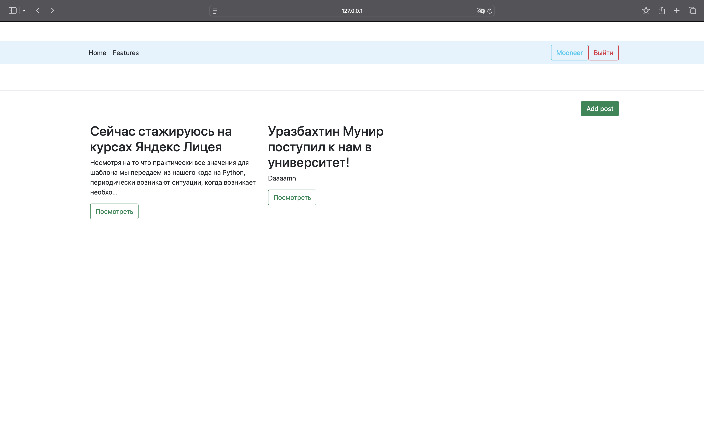
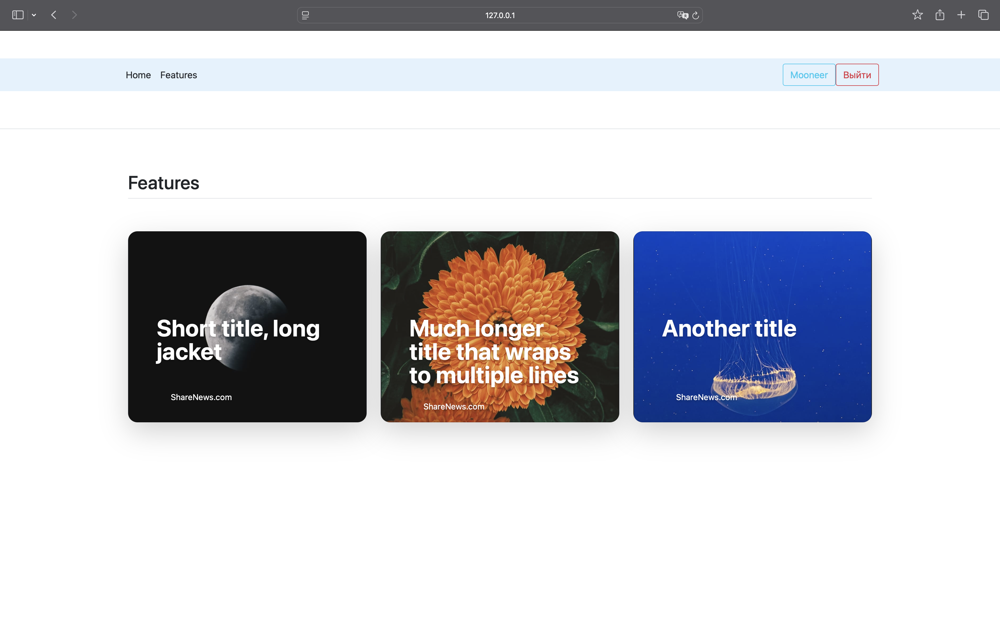
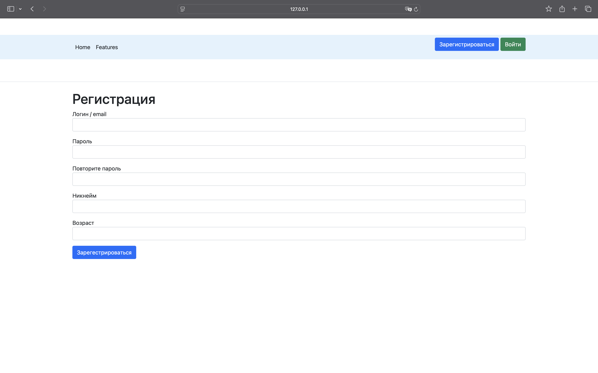
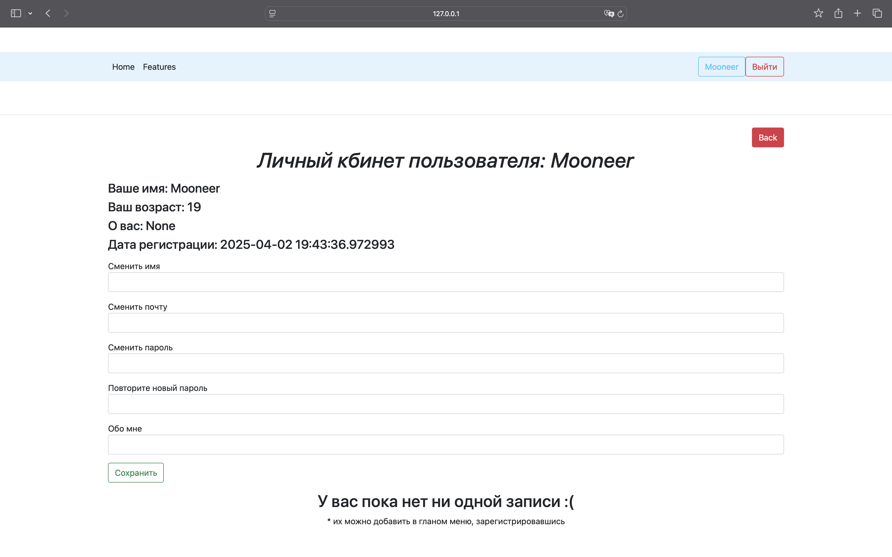
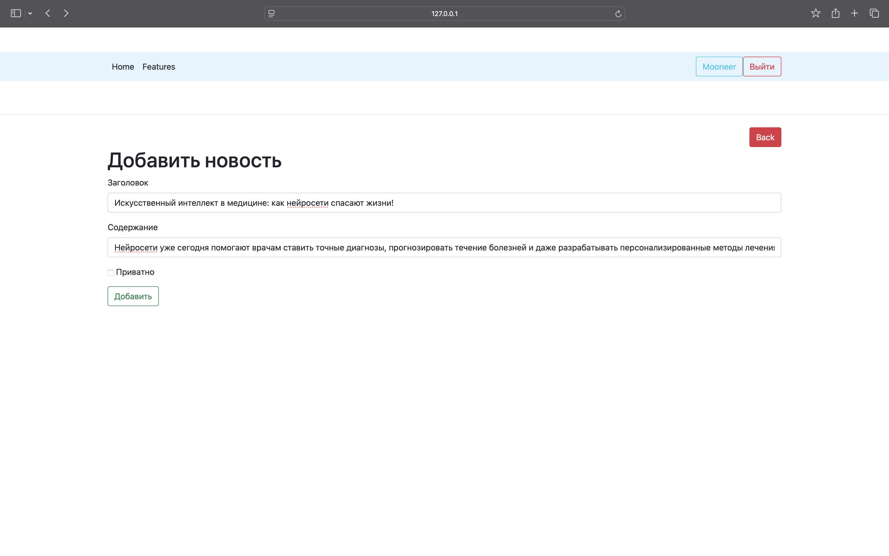
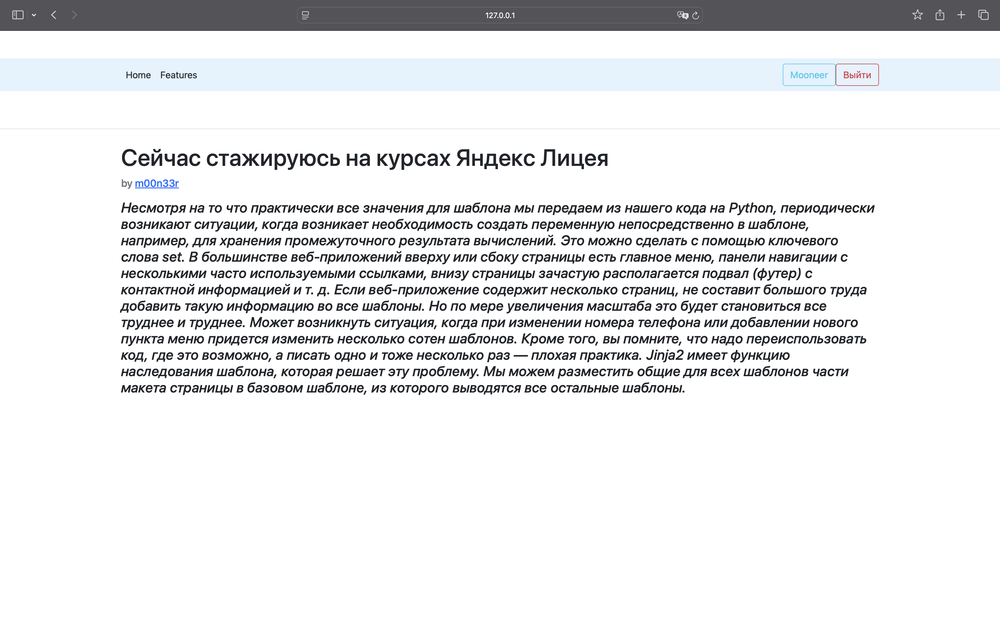

# ShareNews - Flask News Aggregator

<div align="center">
  
  
</div>

Modern news aggregation platform built with Flask, demonstrating advanced Python web development techniques.

## 🚀 Key Features
- User authentication system
- News article aggregation
- Personalized feeds
- RESTful API endpoints
- Responsive UI with Bootstrap

## 🛠 Technology Stack

| Technology | Purpose | Version |
|------------|---------|---------|
| Flask | Web framework | 2.0.3 |
| SQLAlchemy | ORM | 1.4+ |
| Flask-Login | Auth management | 0.5+ |
| BeautifulSoup | Web scraping | 4.10+ |

## 🖼 UI Gallery

<details>
<summary>📸 View UI Screenshots</summary>

### Authentication Flow



### News Interaction


</details>

## 🛠 Installation

1. Clone repository:
```bash
git clone https://github.com/m00n33r/ShareNews_Flask.git
```

2. Set up environment:
```bash
pip install -r requirements.txt
```

3. Run application:
```bash
flask run
```


## 📈 Performance Metrics
- Article loading: <500ms
- Concurrent users: 100+
- DB queries optimized with SQLAlchemy 2.0
## ⚙️ Future updates
- Better frontend
- Faster article load (using Redis)

---

<div align="center">
  <sub>Built with Python 3.13 and ❤️</sub>
</div>
